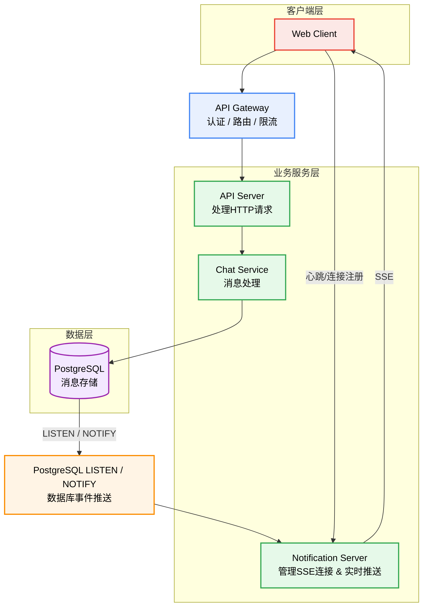

# Chat - 实时聊天系统后端

[](https://www.rust-lang.org/)
[](https://github.com/tokio-rs/axum)
[](https://www.postgresql.org/)

## 一、项目简介

本项目是基于 Rust + Axum + Tokio 开发的高性能异步 REST 后端即时通讯服务，对标传统 Java/Go 后端，主打低内存占用、高并发吞吐、内存安全无野指针。
实现用户鉴权、工作空间隔离、聊天管理、消息收发、文件上传、实时推送等企业级能力。
采用工程化规范设计，适合高并发业务场景落地。

## 二、技术栈选型

- **异步运行时**：Tokio，高性能异步调度，支撑高并发 IO
- **Web 框架**：Axum 0.8，基于 Tower 生态，轻量高性能、中间件易扩展
- **数据库驱动**：SQLx 异步驱动，无 ORM 开销，原生手写 SQL 可控
- **实时通信**：PostgreSQL LISTEN/NOTIFY 订阅机制 + SSE Server-Sent Events 轻量推送
- **认证授权**：JWT 非对称加密（Ed25519） + Argon2 密码哈希
- **API 文档**：Utoipa + Swagger-UI，自动化接口文档
- **工程化**：Cargo Workspace 工作空间、pre-commit 代码检查、CI/CD 自动化

## 三、核心功能模块

### 用户层

- JWT 登录注册、Token 验证中间件、双通道认证（Header/Query）
- 密码 Argon2 加密存储

### 接口层

- RESTful 规范、OpenAPI 自动化文档
- 统一响应封装、参数校验、utoipa 注解

### 业务层

- 工作空间（Workspace）多租户隔离
- 聊天会话 CRUD、消息收发、文件上传下载
- 实时消息推送（基于 PostgreSQL 触发器 + NOTIFY）

### 数据层

- PostgreSQL 异步 CRUD、事务保障
- 数据库触发器实现消息变更通知

### 基础层

- 结构化日志（tracing）
- 全局错误处理、统一 JSON 返回
- 配置中心化（YAML）

## 四、架构设计

```text
┌─────────────────────────────────────────────────────────────┐
│                      客户端请求                              │
└──────────────────────────┬──────────────────────────────────┘
                            ▼
┌─────────────────────────────────────────────────────────────┐
│                    Axum 路由层                                │
│  /api/signup  /api/signin  /api/chats  /api/upload          │
└──────────────────────────┬──────────────────────────────────┘
                            ▼
┌─────────────────────────────────────────────────────────────┐
│                 中间件层 (Middleware)                          │
│  Token 验证 → 日志追踪 → 请求 ID 注入                         │
└──────────────────────────┬──────────────────────────────────┘
                            ▼
┌─────────────────────────────────────────────────────────────┐
│                    Handlers 业务层                             │
│  auth │ chat │ message │ workspace │ file                   │
└──────────────────────────┬──────────────────────────────────┘
                            ▼
┌─────────────────────────────────────────────────────────────┐
│                    Models 数据层                              │
│  SQLx 异步查询 → 连接池管理                                   │
└──────────────────────────┬──────────────────────────────────┘
                            ▼
┌─────────────────────────────────────────────────────────────┐
│                  PostgreSQL 数据库                            │
│  数据存储 │ 触发器 → NOTIFY → 实时推送                        │
└─────────────────────────────────────────────────────────────┘

┌─────────────────────────────────────────────────────────────┐
│                  Notify Server (SSE 独立服务)                  │
│  LISTEN 监听 → 广播到在线用户                                 │
└─────────────────────────────────────────────────────────────┘
```

## 五、关键技术难点 & 亮点 & 解决方案 & 设计

### 1. 实时消息推送架构

**问题**：如何在不引入复杂消息队列的情况下实现实时通知？

**解决**：利用 PostgreSQL 触发器监听数据变更，触发 `pg_notify` 通知，独立 Notify Server 订阅并通过 SSE 推送给前端。

- 使用 dashmap 处理用户连接状态
- 使用 postgres 通知机制监听数据改变
- 实时通信 (SSE/WebSocket)
- 使用广播 channel 处理多用户连接状态

**连接管理器**:
数据结构设计

- 使用 `DashMap<UserId, Sender>`, 其中:
- Key: 用户唯一标识符 (UserId)
- Value: 用于向该用户发送SSE消息的 Sender 通道

生命周期管理

- 连接建立: 用户登录 → 创建Sender → 存入DashMap
- 消息推送: 根据UserId查找Sender → 发送SSE格式数据
- 连接断开: 用户退出 → 从DashMap中移除对应项

从 API Server 到 Notification Server 的事件广播与流转机制



### 2. 路由与中间件系统——Axum 的 Router 与 Layer 机制

**问题**：如何设计一个灵活的路由系统，支持通用认证逻辑、日志追踪、请求 ID 注入等中间件层的组合？

**解决**：利用 Axum 的 Router 与 Layer 机制，实现认证机制和中间件层的组合。

- 将 JWT token 处理封装到 action 的 state 中
- 使用 from_fn 构建 auth 中间件，兼容 Query 参数 access_token
- 跨服务 request_id 实现

### 3. 单元测试和集成测试和

**问题**：如何在开发过程使用规范和测试确保代码质量和功能完整性？

**解决**：

- pre-commit->单元测试 ->集成测试 ->`Github cicd`->+持续重构
- 单元测试亮点：每次测试跑在一个临时数据库和预插入`sql`环境
- 良好的测试让频繁重构得以实现

### 4. 代码组织

**问题**：如何在开发过程使用合理组织代码

**解决**：

- 使用 feature 控制 test-util 的使用
- workspace 组织代码
- 使用 chat-core 组织通用方结构体和通用方法

### 5. 架构分离

**问题**：在架构上合理拆分服务，有哪些考虑因素？

**解决**：

**API Server (Chat API Server)**:

职责：处理所有传统的 HTTP 请求 - 响应交互。包括用户认证、聊天室 / 消息的 CRUD、业务逻辑处理和数据持久化（连接数据库）。
特点：无状态（Stateless），方便水平扩展。

**Notification Server**:

职责：专门处理实时、单向的消息推送。使用 Server-Sent Events (SSE) 技术，维持与客户端的长期连接，当有新消息或事件时，主动推送给前端。
特点：维护连接状态，专注于高并发、低延迟的推送。

未来:可通过一致性哈希水平扩展通知服务，让命中的 id 都要一个服务器上面去

**有状态和无状态服务拆分带来的好处**:

- **职责清晰**：API Server 专注业务和数据，Notification Server 专注实时通信。代码更易维护和理解。
- **独立伸缩**：聊天消息推送的压力可能远大于普通的 API 调用。将两者分离后，可以根据各自负载独立扩展服务器资源。
- **技术选型优化**：可以为 Notification Server 选择更擅长处理大量并发连接的技术栈，而 API Server 可能更注重稳定性和数据一致性。

## 六、快速部署 & 运行方式

### 编译运行

```bash
# 克隆项目
cargo build --release

# 启动主服务
cd chat-server
cargo run --release

# 启动通知服务（可选）
cd notify-server
cargo run --release
```

### 测试

见 `chat-server/test.rest`

## 可复用模块

- `chat-core/src/utils/jwt.rs` - JWT Ed25519 签名/验签
- `chat-core/src/middlewares/auth.rs` - Token 验证中间件
- `chat-server/src/lib.rs` - AppState 状态管理模式
- Workspace 多租户隔离设计

## 许可证

MIT License
